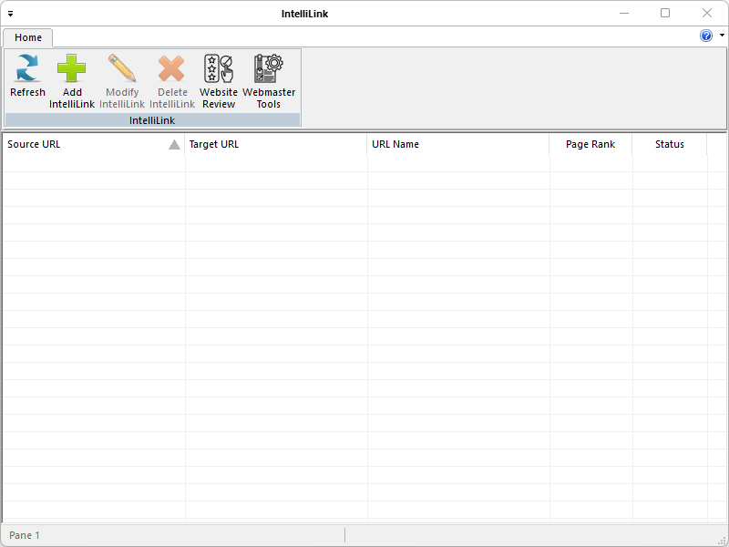

Download:
- [IntelliLinkSetup.msi](https://www.moga.doctor/freeware/IntelliLinkSetup.msi)
- [IntelliLink.zip](https://www.moga.doctor/freeware/IntelliLink.zip)

## Introduction

_IntelliLink_ is a free (as in “free speech” and also as in “free beer”) online link manager. Running in the Microsoft Windows environment, its use is governed by [GNU General Public License v3.0](https://www.gnu.org/licenses/gpl-3.0.html). _IntelliLink_ is written in C++ and uses pure Win32 API and STL which ensures a higher execution speed and smaller program size. By optimizing as many routines as possible without losing user friendliness, _IntelliLink_ is trying to reduce the world carbon dioxide emissions. When using less CPU power, the PC can throttle down and reduce power consumption, resulting in a greener environment. I hope you enjoy _IntelliLink_ as much as I enjoy coding it!

## Getting started

### Install IntelliLink using the installer

- Download the installer
- Run the executable binary and follow the installation flow

The installer will likely require Administrative privileges in order to install _IntelliLink_ (and later, to update _IntelliLink_ or install or update plugins, or anything else that requires writing to the installation directory). If you do not have Administrative privileges, you either need to tell the installer to use a location where you do have write permission (though that may still ask for Administrator privileges), or you may choose not use the installer and instead run a portable edition from a directory where you have write permission.

### Install IntelliLink from zip

These instructions will allow you to run a portable or mini-portable (also called “minimalist”), without requiring administrative privileges.

- Create a new folder somewhere that you have write-permission
- Unzip the content into the new folder
- Run _IntelliLink_ from the new folder

The portable zip edition of _IntelliLink_ can be removed by deleting the directory they came in. If you manually set up file associations or context-menu entries in the OS, it is your responsibility to remove them yourself.

## Application's menu

The _IntelliLink_ menu features the application's most important functions:

- **Refresh**: Refreshes the status of all hyperlinks.
- **Add IntelliLink**: Adds a new hyperlink to the list.
- **Modify IntelliLink**: Modifies the selected hyperlink from the list.
- **Delete IntelliLink**: Deletes the selected hyperlink from the list.
- **Website Review**: Opens [https://www.website-review.ro/](https://www.website-review.ro/) in your web browser.
- **Webmaster Tools**: Opens [https://www.webmaster-tools.ro/](https://www.webmaster-tools.ro/) in your web browser.

## Create and Submit your Pull Request

As noted in the [Contributing Rules](https://github.com/mihaimoga/IntelliLink/blob/main/CONTRIBUTING.md) for _IntelliLink_, all Pull Requests need to be attached to a issue on GitHub. So the first step is to create an issue which requests that the functionality be improved (if it was already there) or added (if it was not yet there); in your issue, be sure to explain that you have the functionality definition ready, and will be submitting a Pull Request. The second step is to use the GitHub interface to create the Pull Request from your fork into the main repository. The final step is to wait for and respond to feedback from the developers as needed, until such time as your PR is accepted or rejected.

## Acknowledges

This open source project uses the following libraries:

- [genUp4win](https://github.com/mihaimoga/genUp4win)
- PJ Naughter's [CHLinkCtrl](https://www.naughter.com/hlinkctrl.html)
- PJ Naughter's [CInstanceChecker](https://www.naughter.com/sinstance.html)
- Lee Thomason's [TinyXML2](https://github.com/leethomason/tinyxml2)
- PJ Naughter's [CTrayNotifyIcon](https://www.naughter.com/ntray.html)
- PJ Naughter's [CVersionInfo](https://www.naughter.com/versioninfo.html)
